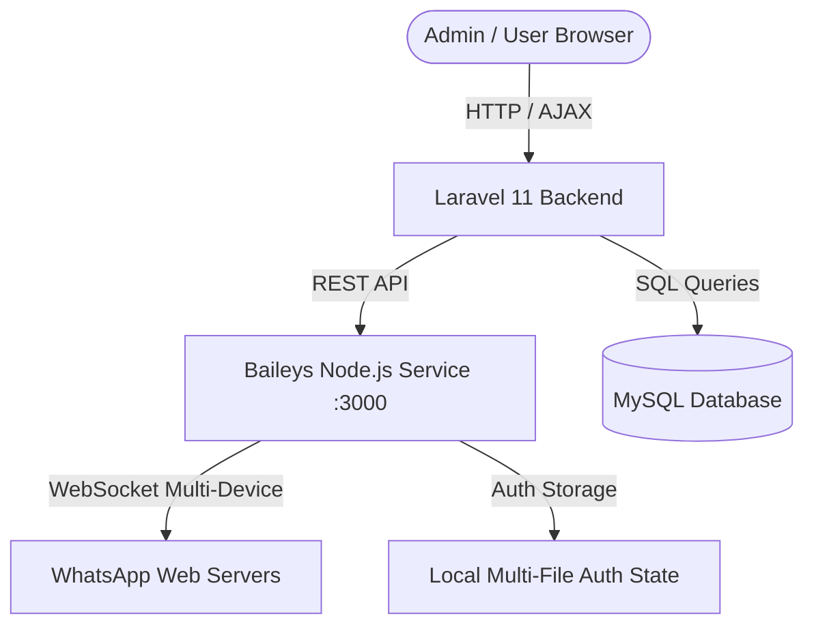

# 🚀 Auto WhatsApp — Multi-Account WhatsApp Automation & Management System

<p align="center">
  
</p>

<p align="center">
  <strong>Complete WhatsApp Marketing, Automation, and Multi-Device Management Platform</strong>
</p>

<p align="center">
  <a href="#features"></a>
  <a href="#tech-stack"></a>
  <a href="#tech-stack"></a>
  <a href="#tech-stack"></a>
  <a href="#tech-stack"></a>
</p>

---

## 📖 Overview

**Auto WhatsApp** is a scalable, modern automation platform designed for managing multiple WhatsApp accounts, automated messaging, and campaign workflows. Powered by **Laravel 11** for the administrative backend and **Baileys (`@whiskeysockets/baileys`)** for real-time WebSocket connection to WhatsApp Web servers.

---

## ✨ Key Features

- 📱 **Multi-Account WhatsApp Connection**: Link unlimited WhatsApp accounts concurrently via Multi-Device QR Code scanning.
- ⚡ **Real-Time Live QR Code Generation**: Instant QR code rendering with auto-refresh and background status synchronization.
- 💬 **Test & Instant Messaging**: Directly test message delivery to any international phone number from connected WhatsApp sessions.
- 🛡️ **End-to-End Encryption**: WhatsApp credentials and auth state keys are stored and managed locally with high security.
- 📊 **Unified Admin Dashboard**: Overview of connected numbers, active sessions, message queues, and users.
- 🌐 **Robust Architecture**: Separation of concerns between the Laravel Web Application and the Node.js Baileys engine.

---

## 🏗️ Architecture



---

## 🛠️ Tech Stack

| Component | Technology | Version / Notes |
| :--- | :--- | :--- |
| **Backend Framework** | [Laravel](https://laravel.com/) | 11.x (PHP 8.2+) |
| **WhatsApp Engine** | [@whiskeysockets/baileys](https://github.com/WhiskeySockets/Baileys) | 6.7.x (Multi-Device) |
| **Microservice Runtime** | [Node.js](https://nodejs.org/) | 20+ / 24+ |
| **Database** | [MySQL / MariaDB](https://mariadb.org/) | 10.4+ / 8.0+ |
| **UI Framework** | Bootstrap 5, LineAwesome, jQuery | Custom Admin Theme |

---

## 📁 Project Structure

```text
auto-whatsapp/
├── assets/                 # Frontend stylesheets, fonts, and assets
├── baileys-service/        # Node.js Baileys WhatsApp microservice
│   ├── sessions/           # Multi-device session keys (git-ignored)
│   ├── package.json        # Service dependencies (@whiskeysockets/baileys, express)
│   └── server.js           # REST API & Baileys socket lifecycle manager
├── core/                   # Laravel 11 application
│   ├── app/                # Controllers, Models, Middleware
│   ├── config/             # App & database configurations
│   ├── database/           # Migrations & seeders
│   ├── resources/views/    # Blade templates (Admin & User layouts)
│   ├── routes/             # Web, Admin, and Console route definitions
│   └── .env.example        # Environment variables template
├── install/                # Installation files & base SQL database dump
│   └── database.sql        # Database schema and initial records
├── index.php               # Web root front controller
├── .gitignore              # Git ignored files & directories
└── README.md               # Project documentation
```

---

## 🚀 Installation & Setup Guide

### 1. Prerequisites
- **PHP** >= 8.2 (with `pdo_mysql`, `curl`, `fileinfo`, `mbstring`, `openssl`, `gd` extensions enabled)
- **Composer** (PHP Package Manager)
- **Node.js** >= 18.x & **NPM**
- **MySQL / MariaDB**

---

### 2. Clone the Repository

```bash
git clone https://github.com/mraheem971/auto-whatsapp.git
cd auto-whatsapp
```

---

### 3. Database Setup

1. Create a new MySQL database:
   ```sql
   CREATE DATABASE `auto_whatsapp` CHARACTER SET utf8mb4 COLLATE utf8mb4_unicode_ci;
   ```
2. Import the initial database schema from `install/database.sql`:
   ```bash
   mysql -u root -p auto_whatsapp < install/database.sql
   ```

---

### 4. Configure Laravel (`core/`)

1. Navigate to the `core/` directory:
   ```bash
   cd core
   ```
2. Copy `.env.example` to `.env`:
   ```bash
   cp .env.example .env
   ```
3. Update database credentials in `core/.env`:
   ```dotenv
   APP_NAME="Auto WhatsApp"
   APP_ENV=local
   APP_DEBUG=true
   APP_URL=http://127.0.0.1:8000

   DB_CONNECTION=mysql
   DB_HOST=127.0.0.1
   DB_PORT=3306
   DB_DATABASE=auto_whatsapp
   DB_USERNAME=root
   DB_PASSWORD=
   ```
4. Install PHP dependencies:
   ```bash
   composer install --ignore-platform-req=php
   ```
5. Generate application key & clear caches:
   ```bash
   php artisan key:generate
   php artisan optimize:clear
   ```

---

### 5. Setup Baileys Microservice (`baileys-service/`)

1. Navigate to the `baileys-service/` directory:
   ```bash
   cd ../baileys-service
   ```
2. Install Node dependencies:
   ```bash
   npm install
   ```

---

### 6. Start the Application

You need two processes running simultaneously:

#### Terminal 1 — Baileys WhatsApp Engine:
```bash
cd baileys-service
npm start
# Runs on http://127.0.0.1:3000
```

#### Terminal 2 — Laravel Application:
```bash
cd core
php artisan serve --port=8000
# Runs on http://127.0.0.1:8000
```

---

## 🔐 Default Admin Credentials

- **Admin Login URL**: [http://127.0.0.1:8000/admin](http://127.0.0.1:8000/admin)
- **Username**: `admin`
- **Password**: `admin`

---

## 📡 Microservice API Reference

The Baileys microservice runs on `http://127.0.0.1:3000` with the following endpoints:

| Method | Endpoint | Description | Payload |
| :--- | :--- | :--- | :--- |
| `GET` | `/health` | Health check & active sessions counter | None |
| `POST` | `/api/sessions/start` | Initialize Baileys session and get live QR | `{ "sessionId": "string", "accountName": "string" }` |
| `GET` | `/api/sessions/status/:sessionId` | Check session connection state & profile | None |
| `POST` | `/api/messages/send` | Send text message to a WhatsApp number | `{ "sessionId": "string", "receiver": "string", "message": "string" }` |
| `POST` | `/api/sessions/delete/:sessionId` | Disconnect and purge auth credentials | None |

---

## 🤝 Contributing

1. Fork the Project
2. Create your Feature Branch (`git checkout -b feature/AmazingFeature`)
3. Commit your Changes (`git commit -m 'Add some AmazingFeature'`)
4. Push to the Branch (`git push origin feature/AmazingFeature`)
5. Open a Pull Request

---

## 📄 License

This project is proprietary and customized for automated WhatsApp operations. All rights reserved.
